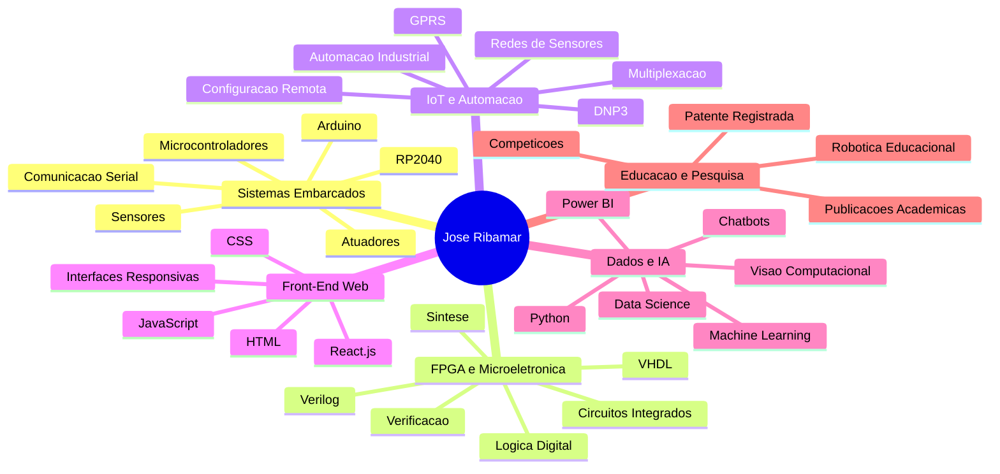

# José Ribamar Cerqueira Muniz

### Engenharia da Computação · Sistemas Embarcados · Desenvolvimento de Software · IoT · Microeletrônica · Front-End

 

---

## Engenharia aplicada para transformar ideias em soluções reais

`Sistemas Embarcados` · `Desenvolvimento de Software` · `IoT` · `Microeletrônica` · `Automação` · `Front-End` · `Robótica Educacional` · `Pesquisa Aplicada`

---

## Perfil

<table>
<tr>
<td width="62%" valign="top">

Sou graduando em <strong>Engenharia da Computação e Sistemas</strong>, com formação técnica em <strong>Tecnologia da Informação</strong> e atuação na integração entre <strong>hardware, software e engenharia aplicada</strong>.

Minha trajetória envolve <strong>sistemas embarcados</strong>, <strong>IoT</strong>, <strong>automação</strong>, <strong>microeletrônica digital</strong>, <strong>robótica educacional</strong>, <strong>pesquisa aplicada</strong> e <strong>desenvolvimento front-end</strong>.

Tenho interesse em projetos que conectam microcontroladores, sensores, protocolos de comunicação, circuitos digitais, interfaces web e soluções aplicadas a problemas reais.

</td>
<td width="38%" valign="top">

<table>
<tr>
<td><strong>Foco técnico</strong></td>
<td>Hardware + Software</td>
</tr>
<tr>
<td><strong>Base</strong></td>
<td>TI + Engenharia da Computação</td>
</tr>
<tr>
<td><strong>Ênfase</strong></td>
<td>Embarcados, Desenvolvimento Web e IoT</td>
</tr>
<tr>
<td><strong>Aplicação</strong></td>
<td>Automação, robótica e front-end</td>
</tr>
<tr>
<td><strong>Localização</strong></td>
<td>São Luís, Maranhão — Brasil</td>
</tr>
</table>

</td>
</tr>
</table>

---

## Destaques

<table>
<tr>
<td align="center" width="25%" valign="top">

  
<strong>EmbarcaTech</strong>
 
Formação prática em Sistemas Embarcados e FPGA.
</td>

<td align="center" width="25%" valign="top">

  
<strong>CI Digital</strong>
 
Especialização em Microeletrônica para Front-End Digital.
</td>

<td align="center" width="25%" valign="top">

  
<strong>Robótica Educacional</strong>
 
Atuação com equipes em competições estaduais, nacionais e internacionais.
</td>

<td align="center" width="25%" valign="top">

  
<strong>Pesquisa Aplicada</strong>
 
Capítulos publicados e participação em patente registrada.
</td>
</tr>
</table>

---

## Áreas de Atuação

<table>
<tr>
<td align="center" width="33%" valign="top">

  
<strong>Sistemas Embarcados</strong>
 
Microcontroladores, RP2040, Arduino, sensores, atuadores, comunicação serial e integração hardware-software.
</td>

<td align="center" width="33%" valign="top">

  
<strong>FPGA e Microeletrônica</strong>
 
VHDL, Verilog, lógica digital, circuitos integrados digitais, síntese e verificação.
</td>

<td align="center" width="33%" valign="top">

  
<strong>IoT e Automação</strong>
 
Redes de sensores, GPRS, DNP3, multiplexação, monitoramento, configuração remota e automação aplicada.
</td>
</tr>

<tr>
<td align="center" width="33%" valign="top">

  
<strong>Front-End Web</strong>
 
HTML, CSS, JavaScript, React.js, componentes, interfaces responsivas e soluções digitais.
</td>

<td align="center" width="33%" valign="top">

  
<strong>Robótica Educacional</strong>
 
Ensino técnico, lógica de programação, prototipagem, sensores, atuadores e competições.
</td>

<td align="center" width="33%" valign="top">

  
<strong>Dados e IA</strong>
 
Python, Data Science, Power BI, chatbots, inteligência artificial e visão computacional embarcada.
</td>
</tr>
</table>

---

## Stack

### Linguagens

### Web, versionamento e ferramentas

 

### Hardware, Embarcados e FPGA

### IoT, Protocolos e Comunicação

### Front-End, Dados e IA

---

## Projeto Aplicado em Destaque

<table>
<tr>
<td width="52%" valign="top">

### Contexto

Durante o **EmbarcaTech**, participei de uma formação prática em **Sistemas Embarcados e FPGA**, com residência tecnológica e desenvolvimento de projeto aplicado com parceiro industrial.

### Solução

Projetei um **multiplexador serial** para comunicação simultânea em sistemas de religadores, integrando **GPRS, DNP3, comunicação protocolar, multiplexação de sinais, microcontroladores, RP2040 com um CI Buffer e configuração remota**.

</td>
<td width="48%" valign="top">

### Competências Aplicadas

| Domínio             | Aplicação                            |
| ------------------- | ------------------------------------ |
| Sistemas embarcados | Integração entre hardware e software |
| RP2040              | Design digital aplicado              |
| Comunicação         | GPRS, DNP3 e protocolos              |
| Automação           | Monitoramento e configuração remota  |
| Engenharia aplicada | Solução em contexto real             |

</td>
</tr>
</table>

---

## Formação e Programas

<table>
<tr>
<td align="center" width="25%" valign="top">

<strong>Engenharia da Computação e Sistemas</strong>   Graduação em andamento

</td>
<td align="center" width="25%" valign="top">

<strong>Técnico em Tecnologia da Informação</strong>   Ensino médio técnico

</td>
<td align="center" width="25%" valign="top">

<strong>CI Digital</strong>   Especialização em Microeletrônica para Front-End Digital

</td>
<td align="center" width="25%" valign="top">

<strong>EmbarcaTech</strong>   Formação prática em Sistemas Embarcados e FPGA

</td>
</tr>
</table>

---

## Experiência Profissional

<strong>Instrutor de Robótica Educacional, Sistemas Embarcados e Automação</strong>

 

Atuação na formação de alunos em robótica, sistemas embarcados e automação, com orientação de equipes para competições tecnológicas em níveis estadual, nacional e internacional.

<strong>Competências aplicadas:</strong>

* Robótica educacional
* Sistemas embarcados
* Automação
* Prototipagem
* Sensores e atuadores
* Ensino técnico
* Liderança de equipes
* Competições tecnológicas

 

<strong>Desenvolvedor Front-End — Tribunal de Contas do Estado do Maranhão</strong>

 

Atuação no desenvolvimento de interfaces e apoio à construção de soluções digitais institucionais.

<strong>Competências aplicadas:</strong>

* Desenvolvimento front-end
* HTML, CSS e JavaScript
* React.js
* Construção de interfaces
* Apoio a sistemas internos

 

<strong>Suporte Técnico — UEMA</strong>

 

Atuação em suporte técnico, atendimento a usuários, manutenção de equipamentos e apoio à infraestrutura de TI.

<strong>Competências aplicadas:</strong>

* Suporte técnico
* Manutenção de computadores
* Diagnóstico de problemas
* Atendimento a usuários
* Infraestrutura de TI

---

## Pesquisa, Inovação e Propriedade Intelectual

<table>
<tr>
<td align="center" width="33%" valign="top">

<strong>Capítulos de Livro</strong>   
Produção acadêmica relacionada a redes de sensores sem fio e aplicações tecnológicas.

</td>
<td align="center" width="33%" valign="top">

<strong>Ergonomia Aplicada</strong>   
Pesquisa voltada a ferramentas de extrativismo, tecnologia aplicada e impacto social.

</td>
<td align="center" width="33%" valign="top">

<strong>Patente Registrada</strong>   
Participação em patente de ferramenta voltada ao setor extrativista.

</td>
</tr>
</table>

---

## Mapa de Competências

---

## GitHub Analytics

 

 

---

 

<table>
<tr>
<td align="center" width="33%">

<strong>Projetos Técnicos</strong>   Sistemas embarcados, IoT, automação, front-end e dados.

</td>
<td align="center" width="33%">

<strong>Pesquisa Aplicada</strong>   Publicações, patente e projetos com impacto tecnológico.

</td>
<td align="center" width="33%">

<strong>Educação Tecnológica</strong>   Robótica educacional, competições e formação de equipes.

</td>
</tr>
</table>

---

## Contato

&nbsp;

&nbsp;

 

Aberto a colaborações em <strong>sistemas embarcados, IoT, FPGA, microeletrônica, automação, front-end e robótica educacional</strong>.

  

<strong>São Luís, Maranhão — Brasil</strong>

